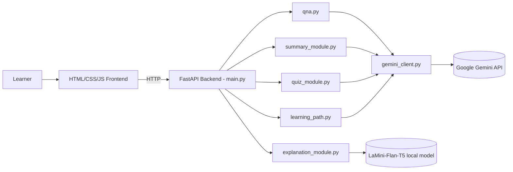

# 3. Project Design Phase

## 3.1 System Architecture

## 3.2 API Design
| Method | Endpoint | Input | Output |
|--------|----------|-------|--------|
| GET | `/` | – | Renders `index.html` |
| GET | `/qa?question=` | question | `{"answer": "..."}` |
| POST | `/explain/` | `{"topic": "..."}` | `{"topic","explanation"}` |
| POST | `/summarize/` | `{"text": "..."}` | `{"summary": "..."}` |
| POST | `/quiz` | `{"text": "..."}` | `{"quiz": [{question, options[4], answer}]}` |
| GET | `/learn/recommendations?topic=` | topic | `{"topic","recommendation"}` |

## 3.3 Data Flow
1. User submits a form → JavaScript `fetch()` calls the endpoint.
2. `main.py` validates the input (400 on empty).
3. The matching module builds a prompt.
4. `gemini_client.generate_text()` calls Gemini (retry with back-off on 429) – or the local T5 model for explanations.
5. Result is returned as JSON and rendered in the result box.

## 3.4 Module Design
| Module | Responsibility |
|--------|----------------|
| `main.py` | Routes, validation, static/templates |
| `gemini_client.py` | Gemini config, `generate_text()`, retry/error handling |
| `qna.py` | Question-answer prompt |
| `explanation_module.py` | Local T5 explanation |
| `summary_module.py` | Summary prompt |
| `quiz_module.py` | Quiz prompt + JSON cleaning/parsing |
| `learning_path.py` | Learning-path prompt |

## 3.5 UI Design
Single centered page (max width 640px) with five cards: Ask a Question, Need an Explanation, Summarize a Paragraph, Generate a Quiz, Get Learning Recommendations. Each has one input, one button and a result area. Quiz results show radio options and a **Check Answer** button with ✅/❌ feedback.

## 3.6 User Flow
Open page → choose feature → enter text → submit → "loading" message → result displayed.

## 3.7 Design Decisions
- **Modular files** so each feature can change independently.
- **Local T5 for explanations** to reduce cloud calls and quota use.
- **Strict JSON prompt for quiz** plus fence-stripping to parse reliably.
